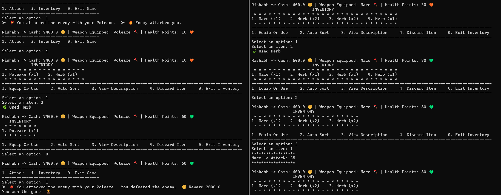
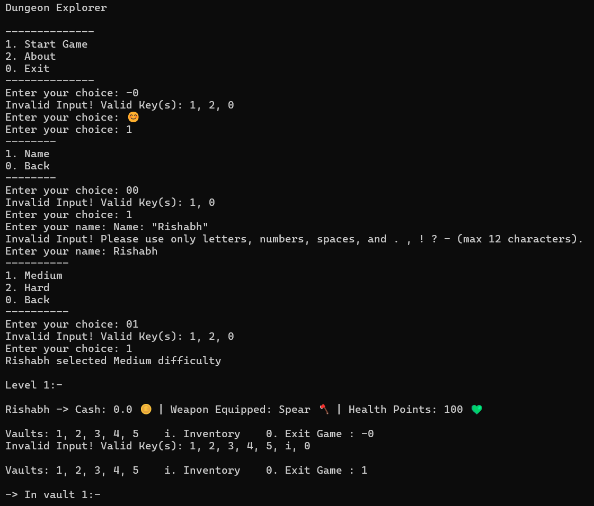
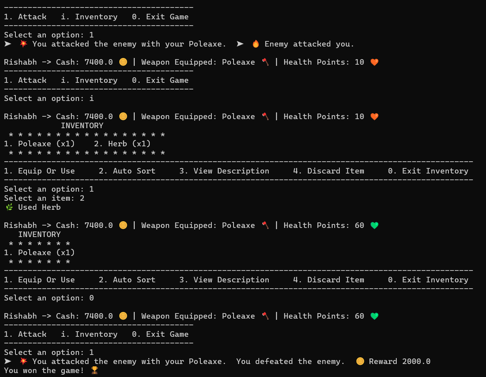
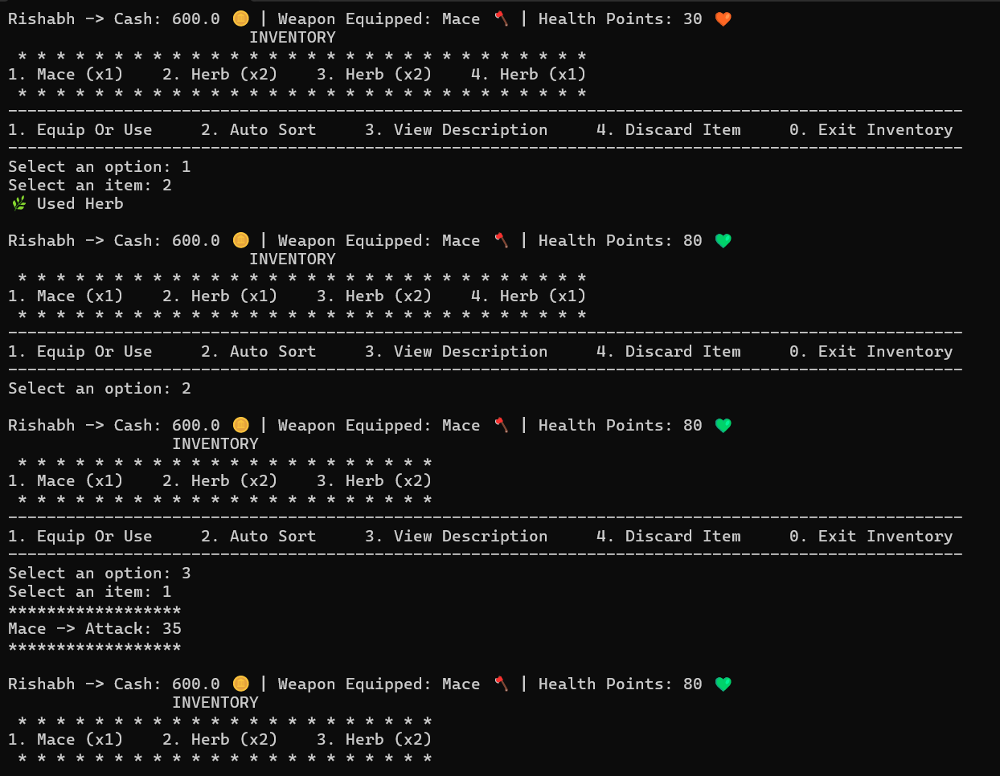
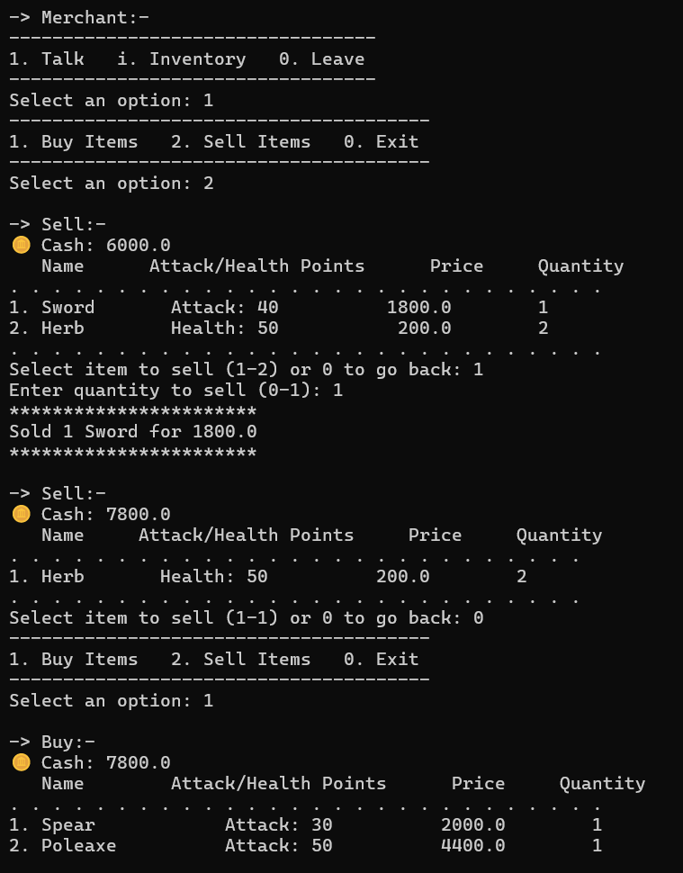
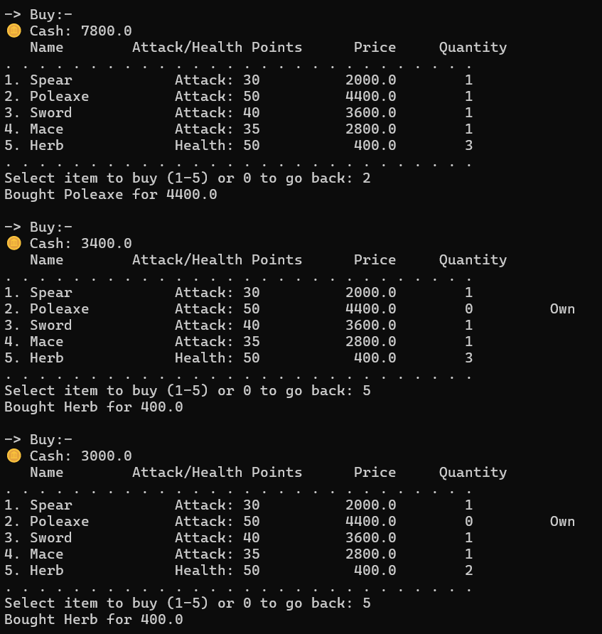

# Dungeon Explorer

A terminal-based RPG adventure game where you battle enemies, collect item and cash, and survive through increasingly challenging dungeon levels. Built with Python and designed with clean architecture principles.




## 📖 About

Dungeon Explorer is a sophisticated text-based RPG that showcases professional Python development practices. Navigate through 4 challenging dungeon levels, battle enemies with strategic combat, manage inventory intelligently, and trade with merchant to survive the final boss encounter.


**This project is a demonstration of:**
- Advanced object-oriented programming in Python
- SOLID principles and clean architecture
- Design patterns (Factory, Facade, Strategy, Protocol)
- Type-safe code with Protocol-based interfaces
- Separation of concerns and maintainable code structure


## ✨ Features

### 🎮 Gameplay
- **4 Progressive Levels** - Each with 5 vaults containing enemies, treasures, and items
- **Strategic Combat** - Turn-based battles with weapon and inventory management
- **Dynamic Economy** - Earn cash from victories, trade with merchants between levels
- **Multiple Difficulties** - Medium and Hard modes with scaled enemy stats
- **Boss Battles** - Face bosses and a final boss encounter

### 🛠️ Technical Excellence
- **100% Type Hinted** - Full type safety with Protocol-based interfaces
- **Zero External Dependencies** - Pure Python standard library
- **Clean Architecture** - SOLID principles throughout
- **Design Patterns** - Factory, Facade, Strategy, and more
- **Modular Design** - Easy to extend and maintain


## 🚀 Quick Start

### Prerequisites

- Python 3.10 or higher
- No external dependencies required (uses only Python standard library)


### Installation

1. Clone the repository:
```bash
git clone https://github.com/RishabhSinghal04/Dungeon_Explorer.git
cd Dungeon_Explorer
```

2. Run the game:
```bash
python main.py
```

That's it! The game runs entirely in your terminal.


## 🎯 How to Play

### Game Flow
1. **Main Menu** → Start new game, view about, or exit
2. **Character Creation** → Enter name and select difficulty
3. **Level Exploration** → Choose vaults (1-5), check inventory (`i`), or exit (`0`)
4. **Combat** → Attack (`1`), manage inventory (`i`), or exit (`0`)
5. **Merchant Trading** → Buy/sell items after clearing all vaults
6. **Boss Battle** → Defeat boss to advance to next level
7. **Victory** → Survive all 4 levels and defeat the final boss!


## 🎮 Game Overview

Dungeon Explorer is a text-based dungeon crawler where you navigate through 4 dangerous levels, each filled with vaults containing enemies, treasures, and healing items. Make strategic decisions about which vaults to enter, manage your inventory wisely, and trade with merchant between levels to maximize your chances of defeating the final boss.

### Controls

| Context | Keys | Actions |
|---------|------|---------|
| **Exploration** | `1-5` | Select crypt |
| | `i` | Open inventory |
| | `0` | Exit game |
| **Combat** | `1` | Attack enemy |
| | `i` | Manage inventory |
| | `0` | Exit game |
| **Inventory** | `1` | Equip/Use item |
| | `2` | Auto-sort items |
| | `3` | View description |
| | `4` | Discard item |
| | `0` | Close inventory |
| **Merchant** | `1` | Buy items |
| | `2` | Sell items |
| | `0` | Exit |


## 🏗️ Architecture

```
Dungeon_Explorer/
├── characters/          # Character, player and enemy classes
│   ├── factories/       # Factory pattern for character creation
│   └── managers/        # Combat and cash management
├── config/              # Game configuration and enums
├── core/                # Core interfaces and protocols
├── game_flow/           # Game state and flow management
├── input_output/        # User input/output handling
├── inventory/           # Inventory system (storage, manager, facade)
├── items/               # Item definitions and factories
├── loaders/             # Configuration file loaders
├── merchant/            # Trading system
|── ui/                  # User interface and display formatting
├── main.py
```


### Design Patterns Used

- **Factory Pattern**: For creating players, enemies, and items
- **Facade Pattern**: Inventory system combines storage and management
- **Protocol Pattern**: Interface-based design for flexibility and testability
- **Strategy Pattern**: Different enemy behaviors and item types


### Key Design Principles

- **SOLID Principles**: Single Responsibility, Open/Closed, Dependency Inversion
- **DRY**: Don't Repeat Yourself - shared logic extracted into reusable components
- **Interface Segregation**: Small, focused protocols for different concerns
- **Type Safety**: Full type hints with Protocol-based interfaces
- **Separation of Concerns**: Clear boundaries between game logic, UI, and data
- **Factory Classes**:


## 🎓 SOLID Principles in Action

### **Single Responsibility Principle (SRP)**
Each class has one clear, focused purpose:

| Class | Responsibility |
|-------|---------------|
| `CombatManager` | Manages combat state (equipped weapon, attacks) |
| `InventoryStorage` | Low-level slot operations |
| `ItemFormatter` | Formats items for merchant display |
| `CombatDisplay` | Handles combat UI output |
| `CashManager` | Manages player currency |

**Example:**
```python
# Combat logic separated from display
class Combat:  # Flow control only
    def start(self) -> EncounterResult: ...

class CombatDisplay:  # Display only
    def show_victory(self, reward: float) -> None: ...
```

### **Open/Closed Principle (OCP)**
Extensible without modification:

- Add new `VaultContent` types without changing `VaultEncounter`
- Add new item types without modifying `ItemFactory`
- Add new enemy types via JSON configuration
- Add new difficulty levels in config

**Example:**
```python
# Adding new vault content type requires no changes to existing code
class TrapContent(VaultContent):  # New type
    def resolve(self, context: GameContext) -> EncounterResult:
        # Implementation
```

### **Liskov Substitution Principle (LSP)**
Interfaces used consistently everywhere:
```python
# Any ICharacter can be attacked - works with Player, Enemy, etc.
def attack(self, target: ICharacter) -> bool:
    target.take_damage(self.attack_points)
    return True
```

### **Interface Segregation Principle (ISP)**
Small, focused interfaces instead of monolithic ones:
```python
# Separated concerns
class IInventoryStorage(Protocol):  # Low-level operations only
    def add_item(self, item: IItem, quantity: int = 1) -> int: ...
    def auto_sort(self) -> None: ...

class IInventoryManager(Protocol):  # High-level queries only
    def get_weapon(self, name: str) -> Optional[IWeapon]: ...
    def get_unique_items(self) -> list[IItem]: ...
```

### **Dependency Inversion Principle (DIP)**
Depend on abstractions, not concrete implementations:
```python
# Combat depends on IEnemy interface, not concrete Enemy class
class Combat:
    def __init__(self, enemy: IEnemy, context: GameContext):
        self._enemy: IEnemy = enemy  # Interface type

# Factory returns interface, not concrete class
def create(self, enemy_type: EnemyType, difficulty: Difficulty) -> IEnemy:  # Returns interface
    return Enemy(stats)  # Concrete implementation
```

### Design Patterns Implemented

#### 🏭 **Factory Pattern**
Centralized object creation with configuration-driven instantiation:
```python
# Encapsulates creation logic, easy to extend with new types
player = PlayerFactory.create_player("Hero")
enemy = EnemyFactory.create(EnemyType.BOSS, Difficulty.HARD)
items = ItemFactory.get_all_weapons()
```
**Benefits:** 
- Encapsulates complex creation logic
- Single point of configuration
- Easy to add new types without modifying existing code

#### 🎭 **Facade Pattern**
Simplified interface to complex inventory subsystem:
```python
# Combines InventoryStorage + InventoryManager behind unified interface
inventory.add_item(item, quantity)
inventory.get_weapon("Sword")
inventory.auto_sort()
```
**Benefits:**
- Simplifies complex subsystem interactions
- Single point of access
- Hides implementation details

#### 📋 **Protocol Pattern (Structural Typing)**
Interface-based design using Python's Protocol:
```python
# Duck typing with type safety
class IPlayer(Protocol):
    @property
    def health_points(self) -> int: ...
    def take_damage(self, amount: int) -> None: ...
```
**Benefits:**
- Loose coupling between components
- Easy to test with mocks
- Flexibility to swap implementations

#### 🎯 **Strategy Pattern**
Interchangeable vault content behaviors:
```python
# Different content types with unified resolution interface
class VaultContent(ABC):
    def resolve(self, context: GameContext) -> EncounterResult: ...

class EnemyContent(VaultContent): ...
class ItemContent(VaultContent): ...
class CashContent(VaultContent): ...
```
**Benefits:**
- Encapsulates algorithms/behaviors
- Open/Closed Principle compliance
- Runtime behavior selection


## 🧩 Additional Design Principles

### **DRY (Don't Repeat Yourself)**
Shared logic extracted into reusable components:
- `confirm_action()` - Reusable yes/no confirmation across all contexts
- `format_with_emoji()` - Consistent emoji formatting
- `ConfigError` - Centralized error handling for all config loading
- `ItemFormatter` - Single source for item display formatting

### **KISS (Keep It Simple, Stupid)**
Simple solutions over complex ones:
- Configuration via JSON files, not complex DSL
- Straightforward turn-based combat, not complex probability systems
- Direct Protocol usage instead of complex adapter patterns

### **YAGNI (You Aren't Gonna Need It)**
Only implement what's actually needed:
- No over-engineered save/load system (stateless game sessions)
- No complex AI for enemies (simple turn-based attacks)
- No unnecessary abstraction layers

### **Separation of Concerns**
Clear boundaries between layers:
```
UI Layer (ui/, input_output/)
    ↓
Application Layer (game_flow/)
    ↓
Domain Layer (characters/, inventory/, items/)
    ↓
Infrastructure Layer (loaders/, config/)
```


## 🎮 Game Mechanics

### ⚔️ Combat System
- **Turn-based** - Player and enemy alternate attacks
- **Weapon-dependent** - Equipped weapon determines damage output
- **Strategic** - Use healing items mid-battle to survive
- **No escape** - Fight to victory or defeat
- **Health tracking** - Real-time health display with emoji indicators




### 🎒 Inventory Management
- **Limited Slots** - Default 5 slots (configurable)
- **Auto-Sort** - Consolidate stacks and remove empty gaps
- **Stackable Items** - Healing items stack up to max_stack value
- **Single Weapon Rule** - Only one weapon equipped at a time
- **Discard Option** - Remove items to make room for better loot
- **View Descriptions** - Detailed item information



### 💰 Economy System
- **Earn Cash** - Defeat enemies to earn coins
- **Buy Weapons** - Purchase from merchants between levels
- **Sell Items** - Get 50% of purchase price back
- **Limited Stock** - Merchants have finite inventory
- **Strategic Planning** - Save for powerful weapons or buy early protection?
- **Dynamic Pricing** - Different items have different values





### 🎚️ Difficulty Scaling

| Difficulty | Enemy Health | Enemy Attack | Cash Rewards | Description |
|------------|-------------|--------------|--------------|-------------|
| **Medium** | Standard | Standard | Standard | Balanced challenge for first playthrough |
| **Hard** | +10 HP | Same | Same | Higher risk, same reward for experienced players |

### 📦 Level Progression
Each level contains:
- **5 Crypts** - Choose which to explore (can't see contents before entering)
- **Random Content Distribution:**
  - 60% chance: Enemy encounter
  - 20% chance: Healing item
  - 20% chance: Cash reward
- **Boss Encounter** - Defeat to advance to next level
- **Merchant Access** - Trade after clearing all crypts, before boss
- **Progressive Difficulty** - Later levels have tougher encounters


## ⚙️ Configuration
Game balance is configurable via JSON files.


# 🛠️ Code Quality

### Type Safety
Full type hints throughout the entire codebase:

### Error Handling
Custom exceptions with clear, actionable error messages:

### Comprehensive Documentation
Every public method includes detailed docstrings:
```python
def buy_item(self, item_name: str, player: IPlayer) -> PurchaseResult:
    """
    Attempt to purchase an item.

    Args:
        item_name: Name of the item to buy.
        player: Player making the purchase.

    Returns:
        PurchaseResult with success status and message.
    """
```

### Validation
Input validation at multiple levels:
- Configuration validation on load
- User input validation
- Business logic validation (inventory space, cash, etc.)
- Type checking


## 🤝 Contributing
Contributions are welcome! Here are some ways you can contribute:

- 🐛 Report bugs or gameplay issues
- 💡 Suggest new features or game mechanics
- 🎨 Improve UI/UX
- 📝 Enhance documentation
- 🧪 Add tests

Please ensure your code follows the existing architecture patterns and includes type hints.


## 🎓 Learning Outcomes

This project demonstrates:

- Advanced OOP concepts in Python
- Design patterns and architectural principles
- Type safety with Protocols
- Clean code practices
- Game development fundamentals
- CLI application development


## 🙏 Acknowledgments

- Inspired by classic roguelike dungeon crawlers
- Built as a learning project to demonstrate clean architecture in Python
- Emoji support for enhanced terminal experience

---

**Enjoy your adventure in the dungeons! May your blade stay sharp and your health potions plentiful.** ⚔️🛡️
